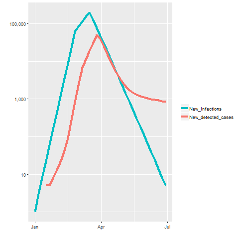
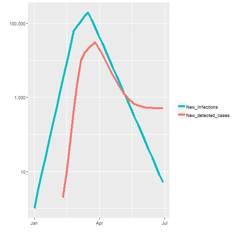
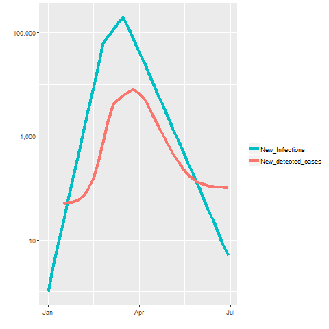
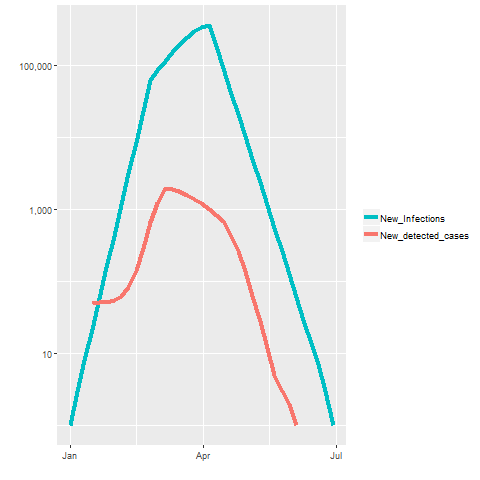
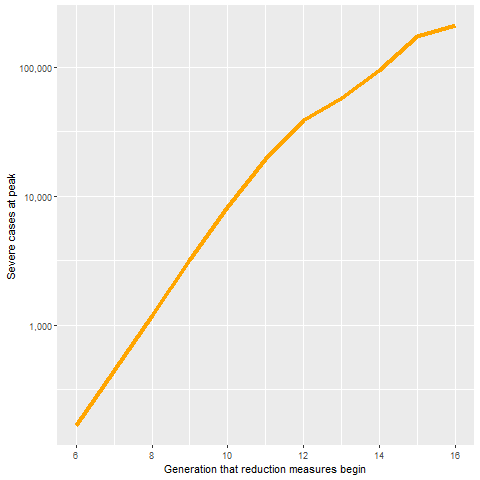

# CovidiaInR


This repository contains an R function of [Nate Silver's Covidia model](https://fivethirtyeight.com/features/coronavirus-case-counts-are-meaningless/) detailed on [FiveThirtyEight.com](FiveThirtyEight.com).

```R
case1 = Covidia538()
```
The function arguments are the named parameters in column B of the original worksheets. The default values correspond to 
Scenario 1.
There is one additional argument, generations, with a default value is 36 (the last generation modeled in the scenarios).

```R
args(Covidia538)

function (Ro_uncontrolled = 2.7, Ro_intermediate = 1.4, Ro_lockdown = 0.7, 
    Cluster_value = "Yes, slightly", Begin_intermediate = 11, 
    Begin_lockdown = 15, Pct_asy = 0.3, Pct_mild = 0.6, Zero_date = "01/01/2020", 
    Serial = 5, Population = 1e+07, Initial_cases = 1, Faux_severe = 0.001, 
    Faux_mild = 0.025, Desire_severe = 1, Desire_mild = 0.5, 
    Desire_asy = 0.02, Initial_tests = 1000, Ramp_period = 3, 
    Test_gowth_rate = 0.5, Tests_max = 1e+07, Rationed_tests = 0.75, 
    False_negative = 0.2, False_positive = 0.005, Delay = 2, 
    generations = 36)
```
The function returns a list with two items. `case$params` shows the list of arguments and their values.
`case$output` is a data frame containing the model output. The column names are similar to those in the original spreadsheet.

```R
> names(case$output)
 [1] "Date"                      "Actual_R"                  "New_Infections"           
 [4] "Cumulative_Infections"     "New_detected_cases"        "Cumulative_detected_cases"
 [7] "Detection_rate"            "New_tests_reported"        "New_share_positive"       
[10] "Target_Ro"                 "Susceptible"               "Actual_severe"            
[13] "Actual_mild"               "Actual_asy"                "Pop_severe"               
[16] "Pop_mild"                  "Pop_asy"                   "Desiring_tests_severe"    
[19] "Desiring_tests_mild"       "Desiring_tests_asy"        "Tests_available"          
[22] "Rationed_tests_available"  "On_demand_tests"           "Rationed_tests_severe"    
[25] "Rationed_tests_mild"       "Rationed_tests_asy"        "Unmet_demand_tests_severe"
[28] "Unmet_demand_tests_mild"   "Unmet_demand_tests_asy"    "Unmet_demand_total"       
[31] "On_demand_tests_severe"    "On_demand_tests_mild"      "On_demand_tests_asy"      
[34] "Tests_conducted_severe"    "Tests_conducted_mild"      "Tests_conducted_asy"      
[37] "Share_positive_severe"     "Share_positive_mild"       "Share_positive_asy"       
[40] "Positive_tests_severe"     "Positive_tests_mild"       "Positive_tests_asy"       
[43] "Reported_new_positives"    "Nominal_R"                 "Share_positive" 
````

The first few columns of `case$output`:

| Date | Actual_R | New_Infections | Cumulative_Infections | New_detected_cases |
|---|----|----|----|----|
| 2020-01-01 | 3.0000000 | 1 | 1 | 0 |
| 2020-01-06 | 2.6666667 | 3 | 4 | 0 |
| 2020-01-11 | 2.7500000 | 8 | 12 | 0 |
| 2020-01-16 | 2.6818182 | 22 | 34 | 5 |
| 2020-01-21 | 2.6949153 | 59 | 93 | 5 |
| 2020-01-26 | 2.6981132 | 159 | 252 | 8 |	
| 2020-01-31 | 2.6993007 | 429 | 681 | 13 |
| 2020-02-05 | 2.6986183 | 1158 | 1839 | 21 |
| 2020-02-10 | 2.6969600 | 3125 | 4964 | 38 |
| 2020-02-15 | 2.6915045 | 8428 | 13392 | 92 |	
    
## The scenarios described in the article   

The details of the scenarios are described in the original post. The arguments for the different scenarios are expressed
as differences from a "base case" -  in this case the first scenario. Of course, the base case (default) could be specified
differently, for example as a "no infection" scenario, but this would complicate the use of the function by requiring more
parameters to specified in each infection scenario.

## Scenario 1: Robust test growth

```R
library(reshape2)
library(ggplot2)
library(dplyr)
library(scales)
# My column order is different, it seems.
switch_colors = scale_color_manual(values=c("#00BFC4", "#F8766D"))

scenario1 = Covidia538()

c1 <- scenario1$output %>%
  melt(id="Date") %>%
  mutate(value= replace(value, value == 0, NA) )

plotit <- function(x) {
  x[x$variable %in% c("New_Infections","New_detected_cases"),] %>%
    ggplot() + 
    geom_line(aes(x=Date,y=value, group=variable, color=variable), size=1.5) +
    scale_y_continuous(trans='log10', labels=comma) +
    xlab("") + ylab("") + theme(legend.title = element_blank()) +
    switch_colors
}

plotit(c1)
```


## Scenario 2: Sudden one-time increase in testing

```R
scenario2 = Covidia538(Initial_tests=100, Ramp_period=6, Test_gowth_rate=2, Tests_max=100000)

scenario2$output %>%
  melt(id="Date") %>%
  mutate(value= replace(value, value == 0, NA) ) %>%
  plotit()
```


## Scenario 3: High test floor, low test ceiling

```R
scenario3 = Covidia538(Initial_tests=10000, Ramp_period=2, Test_gowth_rate=0.03, Tests_max=20000, Rationed_tests = 1)

scenario3$output %>%
  melt(id="Date") %>%
  mutate(value= replace(value, value == 0, NA) ) %>%
  plotit()
```


## Scenario 4: A testing decrease

```R
scenario4 = Covidia538(Begin_lockdown=19, Initial_tests=10000, Ramp_period=10,T est_gowth_rate=-0.2, Tests_max=10000, Rationed_tests = 1)

scenario4$output %>%
  melt(id="Date") %>%
  mutate(value= replace(value, value == 0, NA) ) %>%
  plotit()
```



## A curve-flattening example
Here's a simple example to show how the function can be employed to create and compare multiple scenarios.

The sooner measures to reduce Ro are implemented in this fictitious population, 
the maximum number of severe cases seen in the population is reduced. 
This plot shows the maximum number of severe cases in any generation seen over the entire time frame for the
generation of reduction measures begin.

```R
start = c(6:16)
dd = sapply(start, function(x) Covidia538(Begin_intermediate = x, Begin_lockdown = x +4)$output$Actual_severe)
ddm = cbind("i"=as.factor(c(0:36)),"col"= "severe", data.frame(dd) )
aa = ddm %>% rbind(ddm) %>%
  melt() %>% 
  group_by(col,variable) %>% 
  summarize(max=max(value))
  
data.frame("x"=start, "plotval"= aa$max) %>%
  ggplot() + 
    geom_line(aes(x=x,y=plotval), group=1, size=1.5, color="orange") +
    scale_y_continuous(trans='log10', labels=comma) +
    xlab("Generation that reduction measures begin") + ylab("Severe cases at peak") 
```


